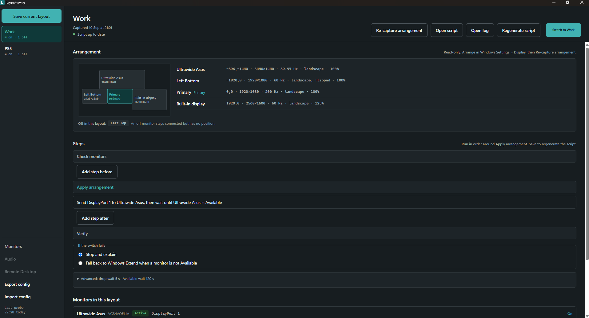
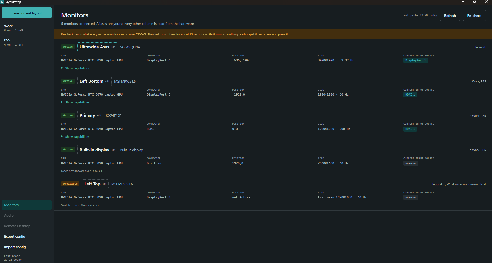

# layoutswap

[](https://github.com/marioalvarez32/layoutswap/actions/workflows/ci.yml)
[](https://github.com/marioalvarez32/layoutswap/releases)

Save the monitor arrangements you use on Windows and switch between them with one
click. A layout is more than positions: it records which monitors are on or off,
the input each shared monitor should show, and the steps a real switch needs, such
as waiting for a monitor to come back after you press its input button. Every layout
becomes a generated script and a shortcut, so switching works with the app closed.

**Status:** pre-alpha, in daily use on the machine it was built against. The app
reads the connected monitors, captures the arrangement Windows shows as a named
layout, lets you add steps around the apply, switches from inside the app with live
progress, and verifies the result. The Monitors screen lists every monitor with its
state and what it declares it can do. Audio endpoints and Remote Desktop profiles are
the next slices.

## Screenshots

The layout detail: the captured arrangement with its schematic, the steps that run
around the apply, the fallback choice, and the monitors in the layout.



The Monitors screen: every monitor Windows knows about, with its alias, state,
GPU, connector, position, size and current input source, and the capabilities each
one declares over DDC-CI.



## Why

Windows remembers one arrangement per set of connected monitors, and rebuilding
another one by hand in Settings > Display takes a minute of dragging every time.
Anyone with more than two monitors ends up with a few arrangements they keep coming
back to:

- A work layout with every monitor on, and a focus layout with only the main one.
- A film or gaming layout where the big monitor is the primary and the rest are off.
- A docked laptop that should look the same each time it comes back to the desk.
- A monitor shared with another device, a console or a second PC, that has to be
  handed over with its input button and taken back later.

The last case is where layoutswap started: a monitor's input changes, Windows drops
the monitor, a spare one takes its place, and later all of it has to be undone,
while Windows reshuffles Remote Desktop monitor numbers and re-enables monitor
speakers every time the topology changes. Two PowerShell scripts grew to handle
that on one machine. layoutswap turns them into something anyone can configure,
for any set of layouts.

## What it does today

- Unlimited named layouts, captured from the arrangement Windows currently shows,
  each with a schematic and a spec table.
- Per layout: which connected monitors are on or off; ordered steps before and after
  the apply, sending an input source to a monitor and waiting for it to drop or to
  come back; a fallback to Windows Extend when the apply fails.
- Switch from the app with a live timeline, a needs-you band when a monitor waits
  for a button press, and a result that says what to do next; or from the generated
  script with the app closed.
- A Monitors screen: alias, state (Active, Available, Absent, and asleep), GPU,
  connector, position, size and current input source per monitor, plus the inputs
  it accepts, whether the app can wake it and the modes Windows lists, read on
  request.
- Export and import of the whole configuration, and a diagnostics zip for a failed
  switch.

## What v1 will add

- Enable, disable or set the default audio endpoint per layout.
- Refresh Remote Desktop profiles as a step, with a scheduled task at logon and
  unlock.
- A shortcut per layout on the Desktop or in the Start menu.

## What v1 does not do

- A draggable arrangement editor. Arrange in Windows Settings, then save.
- A tray icon, hotkeys, or any resident process.
- Anything outside Windows.

## Architecture at a glance

The app is the editor; generated scripts are the runtime. Rust renders a PowerShell
script per layout from typed config and runs it; the Vue window never handles script
text. Layouts identify monitors by device path so they survive reboots. The
reasoning is in `docs/adr/`, starting with ADR-0001, ADR-0002 and ADR-0003, and the
hardware facts behind them are in `docs/windows-behaviour.md`.

| Part | Choice |
|---|---|
| Shell | Tauri 2, Rust backend |
| UI | Vue 3, TypeScript strict, Pinia |
| Generated scripts | Windows PowerShell 5.1 |
| Tooling | pnpm, Vite, Vitest, ESLint |

## Hardware it was built against

Any Windows 11 machine with several monitors should work; these are the parts the
hardware facts were learned on.

| Part | Model |
|---|---|
| Laptop | Lenovo Legion 5 15IAX10, NVIDIA RTX 5070 + Intel Arc |
| Dock | Kensington AD4010T4 |
| Monitors | ASUS VG34VQEL1A ultrawide, two MSI MP165 E6, Acer KG241Y X1, LG FULL HD, built-in panel |

## Install

Each release on the [releases page](https://github.com/marioalvarez32/layoutswap/releases)
carries an MSI and an NSIS setup for 64-bit Windows 11. The app writes everything it
owns under `%LOCALAPPDATA%\layoutswap`; delete that folder to start fresh.

## Development

Prerequisites: Node with pnpm, the Rust toolchain (`x86_64-pc-windows-msvc`), the
Visual Studio C++ build tools, and the WebView2 runtime that ships with Windows 11.

```
pnpm install          # once per clone; also installs the commit-msg hook
pnpm tauri dev        # opens the app with hot reload
pnpm tauri build      # release build and installers under src-tauri/target/release
pnpm lint             # ESLint: lint and formatting check
pnpm format           # ESLint --fix: rewrite formatting
pnpm typecheck        # vue-tsc, TypeScript strict
pnpm test             # Vitest with Vue Test Utils
pnpm test:rust        # cargo test for the backend
pnpm lint:rust        # cargo clippy with warnings denied
pnpm generate:types   # regenerate src/domain/generated/types.ts from the Rust types
```

`cargo test` also regenerates the TypeScript bindings, so a change to a shared Rust
type shows up as a diff in the generated file, and CI fails when that diff was not
committed. CI runs every check above on each push to `main` and each pull request.

Releases are cut by semantic-release after a green CI run on `main`: it reads the
Conventional Commits since the last release, picks the version (`fix` is a patch,
`feat` a minor, a `BREAKING CHANGE` footer a major), writes the notes into
`CHANGELOG.md`, bumps the version in `package.json`, `tauri.conf.json` and
`Cargo.toml`, builds the installers and publishes a GitHub release with them
attached. A commit-msg hook (commitlint) refuses a commit subject it could not read,
so the changelog stays honest.

The engineering process, from idea to merged change, is in `CONTRIBUTING.md`. Code
conventions are in `CODING_STANDARDS.md`; UI decisions in `DESIGN.md`; the domain
vocabulary in `CONTEXT.md`.

## License

MIT. See `LICENSE`.
